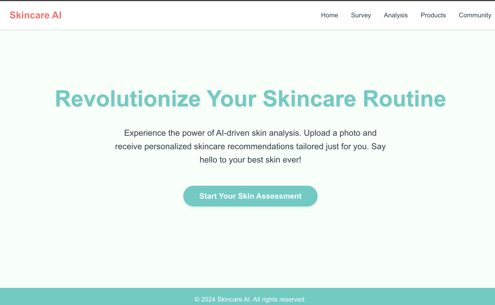

# Revolutionize Your Skincare Routine

Experience the power of AI-driven skin analysis. Upload a photo and receive personalized skincare recommendations tailored just for you. Say hello to your best skin ever!

# Start Generation Here



## Features

- **AI-Driven Skin Analysis**: Get insights into your skin's condition.
- **Personalized Recommendations**: Tailored skincare routines based on your unique skin profile.
- **User-Friendly Interface**: Easy photo upload and navigation.

## Getting Started

### Prerequisites

- Node.js (for backend)
- React.js (for frontend)

### Installation

1. **Clone the repository**:

   ```bash
   git clone https://github.com/ThomasC86/HackMIT-2024
   cd HackMIT-2024
   ```

2. **Set up the backend**:

   ```bash
   cd backend
   npm install
   npm start
   ```

3. **Set up the frontend**:
   ```bash
   cd frontend
   npm install
   npm start
   ```

## Start Your Skin Assessment

Visit the application in your browser and upload a photo to begin your personalized skincare journey.

© 2024 Skincare AI. All rights reserved.
